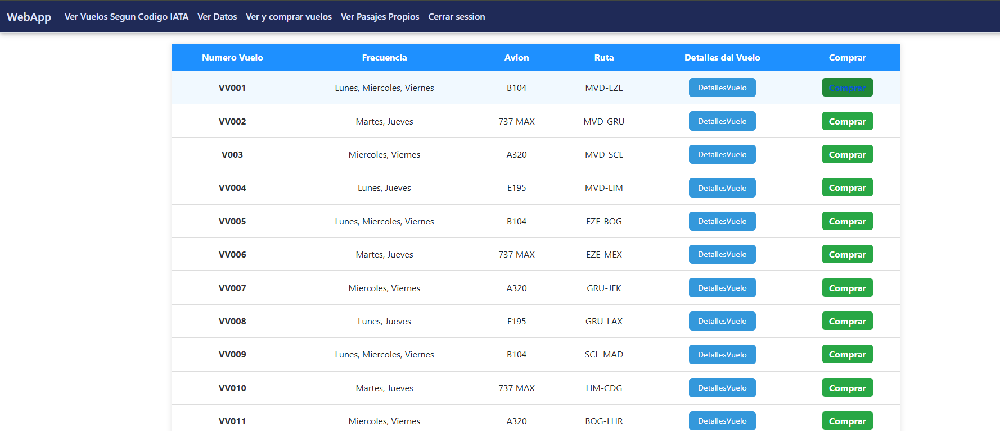
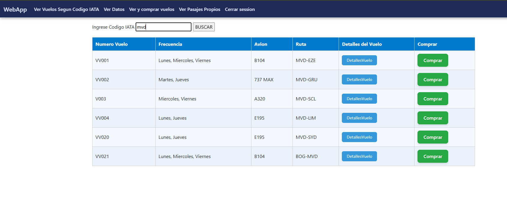
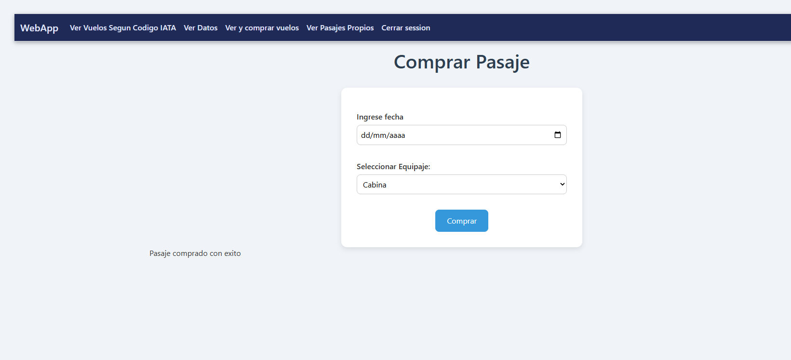
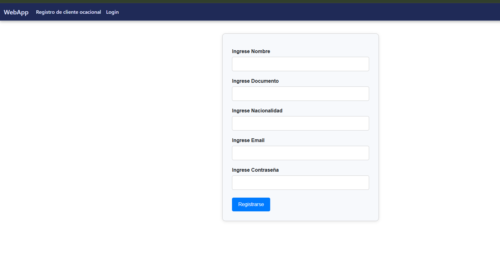

# Sistema de Gestión de Vuelos y Pasajes ✈️

Proyecto académico desarrollado para **Programación 2** de la carrera **Analista en Tecnologías de la Información** en Universidad ORT Uruguay.

Aplicación web desarrollada en **C# y ASP.NET Core (.NET 8)** para la gestión y consulta de vuelos, usuarios y compra de pasajes. El proyecto aplica programación orientada a objetos, reglas de negocio y una estructura MVC con separación entre dominio, controladores y vistas.

## Funcionalidades

- Consulta del listado de vuelos.
- Búsqueda de vuelos por código IATA.
- Visualización de información de vuelos, rutas y aviones.
- Compra de pasajes.
- Selección de equipaje durante la compra.
- Registro e inicio de sesión de usuarios.
- Consulta de pasajes del cliente.
- Manejo de clientes ocasionales y premium.
- Lógica de aeropuertos, rutas, aviones y frecuencias.

## Tecnologías utilizadas

- C#
- .NET 8
- ASP.NET Core MVC
- Razor Views
- HTML y CSS
- Programación Orientada a Objetos (POO)

## Estructura del proyecto

- **Dominio:** entidades, validaciones, lógica y reglas de negocio.
- **WebApp:** controladores, vistas y configuración de la aplicación web.
- **Obligatorio.sln:** solución de Visual Studio que agrupa los proyectos.

## Capturas

### Listado de vuelos

### Búsqueda por código IATA

### Compra de pasaje

### Registro de cliente

## Contexto académico

Proyecto realizado en equipo para la materia **Programación 2** de Universidad ORT Uruguay, con foco en programación orientada a objetos, modelado del dominio, reglas de negocio y desarrollo web con ASP.NET Core MVC.

## Autor

**Facundo Labarthe**

- GitHub: https://github.com/faculabarthe
- LinkedIn: https://www.linkedin.com/in/facundo-labarthe-samaloff-4b8339375
- Portfolio: https://www.facundolabarthe.com
